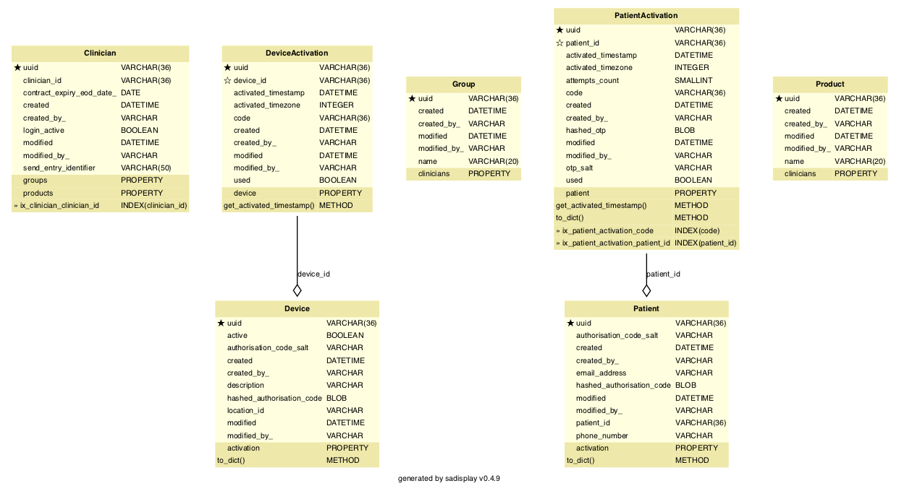
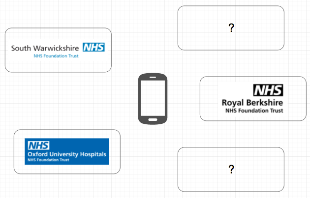
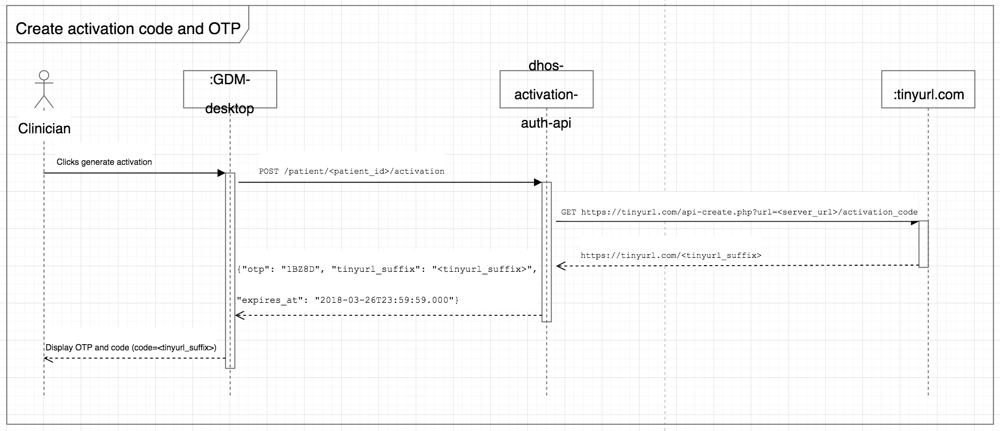
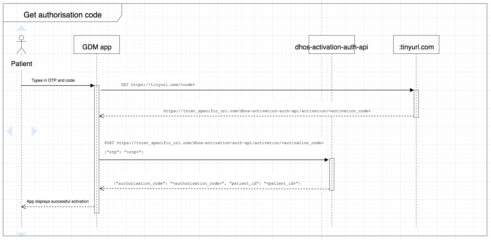
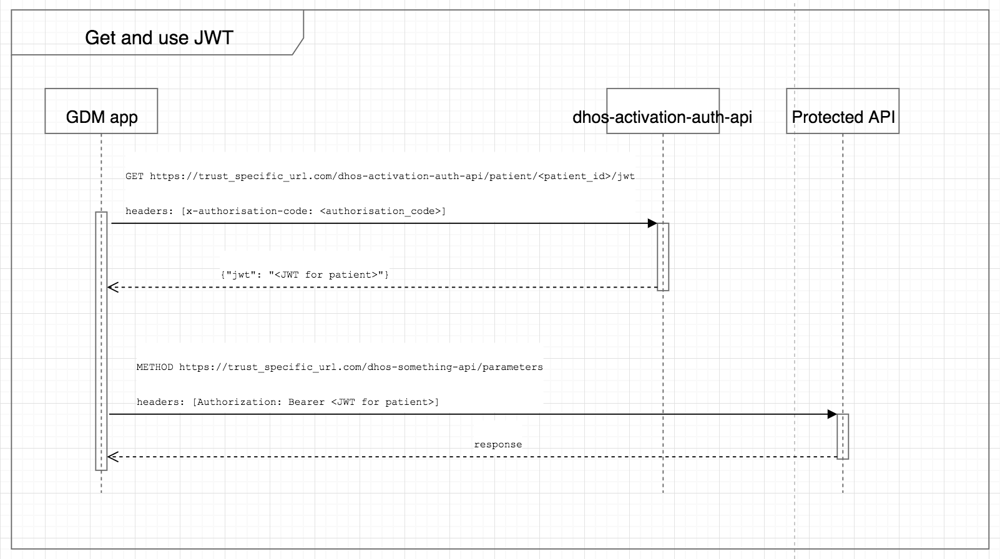

<!-- Title - A concise title for the service that fits the pattern identified and in use across all services. -->
# Polaris Activation Auth API

[](https://github.com/ambv/black)

<!-- Description - Fewer than 500 words that describe what a service delivers, providing an informative, descriptive, and comprehensive overview of the value a service brings to the table. -->
The Activation Auth API is part of the Polaris platform (formerly DHOS). This service allows activation, 
authentication and authorisation of users via JWT.

This service is primarily used for activation/authentication of two separate flows:
- Patients using mobile apps (for example, GDM)
- Clinicians using webapps on known devices (for example, SEND Entry)

## Maintainers
The Polaris platform was created by Sensyne Health Ltd., and has now been made open-source. As a result, some of the
instructions, setup and configuration will no longer be relevant to third party contributors. For example, some of
the libraries used may not be publicly available, or docker images may not be accessible externally. In addition, 
CICD pipelines may no longer function.

For now, Sensyne Health Ltd. and its employees are the maintainers of this repository.

## Setup
These setup instructions assume you are using out-of-the-box installations of:
- `pre-commit` (https://pre-commit.com/)
- `pyenv` (https://github.com/pyenv/pyenv)
- `poetry` (https://python-poetry.org/)

You can run the following commands locally:
```bash
make install  # Creates a virtual environment using pyenv and installs the dependencies using poetry
make lint  # Runs linting/quality tools including black, isort and mypy
make test  # Runs unit tests
```

You can also run the service locally using the script `run_local.sh`, or in dockerized form by running:
```bash
docker build . -t <tag>
docker run <tag>
```

## Documentation
<!-- Include links to any external documentation including relevant ADR documents.
     Insert API endpoints using markdown-swagger tags (and ensure the `make openapi` target keeps them up to date).
     -->

<!-- markdown-swagger -->
 Endpoint                                   | Method | Auth? | Description                                                                                                                                                                                                                    
 ------------------------------------------ | ------ | ----- | -------------------------------------------------------------------------------------------------------------------------------------------------------------------------------------------------------------------------------
 `/running`                                 | GET    | No    | Verifies that the service is running. Used for monitoring in kubernetes.                                                                                                                                                       
 `/version`                                 | GET    | No    | Get the version number, circleci build number, and git hash.                                                                                                                                                                   
 `/dhos/v1/patient/{patient_id}/activation` | POST   | Yes   | Create a new activation for a patient. Responds with a shortened URL and a one-time-pin, to be used once to validate the activation.                                                                                           
 `/dhos/v1/patient/{patient_id}/activation` | GET    | Yes   | Responds with a list of activations created for the specified patient UUID.                                                                                                                                                    
 `/dhos/v1/patient/{patient_id}/jwt`        | GET    | No    | Responds with a valid patient JWT. Requires the `x-authorisation-code` header containing an authorisation code acquired by validating a patient activation.                                                                    
 `/dhos/v1/clinician`                       | POST   | Yes   | Create a clinician object, only to be used for storing clinician login details. Not to be confused with the clinician object in the Polaris Users API.                                                                         
 `/dhos/v1/clinician/{clinician_id}`        | PATCH  | Yes   | Update a clinician object, only to be used for storing clinician login details.                                                                                                                                                
 `/dhos/v1/clinician/jwt`                   | GET    | Yes   | Responds with a valid clinician JWT. Requires a device JWT for authorisation.                                                                                                                                                  
 `/dhos/v1/device`                          | POST   | Yes   | Create a known device containing details including location and name.                                                                                                                                                          
 `/dhos/v1/device`                          | GET    | Yes   | Responds with a list of known devices, containing details such as location and name.                                                                                                                                           
 `/dhos/v1/device/{device_id}`              | GET    | Yes   | Get details of the known device with the specified UUID.                                                                                                                                                                       
 `/dhos/v1/device/{device_id}`              | PATCH  | Yes   | Update details of the known device with the specified UUID.                                                                                                                                                                    
 `/dhos/v1/device/{device_id}/activation`   | POST   | Yes   | Create a new activation for a known device. Responds with an activation code, to be used once to validate the activation.                                                                                                      
 `/dhos/v1/device/{device_id}/jwt`          | GET    | No    | Responds with a valid device JWT. Requires the `x-authorisation-code` header containing a code acquired by validating a device activation.                                                                                     
 `/dhos/v1/activation/{activation_code}`    | POST   | No    | Validate ('activate') a previously-created activation for a patient or device. Requires the one-time-PIN (OTP) provided when the activation was created. Responds with a valid authorisation code to be used to retrieve a JWT.
<!-- /markdown-swagger -->

## Requirements
<!-- An outline of what other services, tooling, and libraries needed to make a service operate, providing a
  complete list of EVERYTHING required to work properly. -->
  At a minimum you require a system with Python 3.9. Tox 3.20 is required to run the unit tests, docker with docker-compose are required to run integration tests. See [Development environment setup](https://sensynehealth.atlassian.net/wiki/spaces/SPEN/pages/3193270/Development%2Benvironment%2Bsetup) for a more detailed list of tools that should be installed.
  
## Deployment
<!-- Setup - A step by step outline from start to finish of what is needed to setup and operate a service, providing as
  much detail as you possibly for any new user to be able to get up and running with a service. -->
  
  All development is done on a branch tagged with the relevant ticket identifier.
  Code may not be merged into develop unless it passes all CircleCI tests.
  :partly_sunny: After merging to develop tests will run again and if successful the code is built in a docker container and uploaded to our Azure container registry. It is then deployed to test environments controlled by Kubernetes.

## Testing
<!-- Testing - Providing details and instructions for mocking, monitoring, and testing a service, including any services or
  tools used, as well as links or reports that are part of active testing for a service. -->

### Unit tests
:microscope: Either use `make` or run `tox` directly.

<!-- markdown-make Makefile tox.ini -->
`tox` : Running `make test` or tox with no arguments runs `tox -e lint,default`

`make clean` : Remove tox and pyenv virtual environments.

`tox -e debug` : Runs last failed unit tests only with debugger invoked on failure. Additional py.test command line arguments may given preceded by `--`, e.g. `tox -e debug -- -k sometestname -vv`

`make default` (or `tox -e default`) : Installs all dependencies, verifies that lint tools would not change the code, runs security check programs then runs unit tests with coverage. Running `tox -e py39` does the same but without starting a database container.

`tox -e flask` : Runs flask within the tox environment. Pass arguments after `--`. e.g. `tox -e flask -- --help` for a list of commands. Use this to create database migrations.

`make help` : Show this help.

`make lint` (or `tox -e lint`) : Run `black`, `isort`, and `mypy` to clean up source files.

`make openapi` (or `tox -e openapi`) : Recreate API specification (openapi.yaml) from Flask blueprint

`make pyenv` : Create pyenv and install required packages (optional).

`make readme` (or `tox -e readme`) : Updates the README file with database diagram and commands. (Requires graphviz `dot` is installed)

`make test` : Test using `tox`

`make update` (or `tox -e update`) : Updates the `poetry.lock` file from `pyproject.toml`

<!-- /markdown-make -->

## Integration tests
:nut_and_bolt: Integration tests are located in the `integration-tests` sub-directory. After changing into this directory you can run the following commands:

<!-- markdown-make integration-tests/Makefile -->
<!-- /markdown-make -->

## Issue tracker
:bug: Bugs related to this microservice should be raised on Jira as [PLAT-###](https://sensynehealth.atlassian.net/issues/?jql=project%20%3D%20PLAT%20AND%20component%20%3D%20Locations) tickets with the component set to Locations.

## Database migrations
Any changes affecting the database schema should be reflected in a database migration. Simple migrations may be created automatically:

```$ tox -e flask -- db migrate -m "some description"```

More complex migration may be handled by creating a migration file as above and editing it by hand.
Don't forget to include the reverse migration to downgrade a database.
  
## Configuration
<!-- Configuration - An outline of all configuration and environmental variables that can be adjusted or customized as part
  of service operations, including as much detail on default values, or options that would produce different known
  results for a service. -->
  * `DATABASE_USER, DATABASE_PASSWORD,
   DATABASE_NAME, DATABASE_HOST, DATABASE_PORT` configure the database connection.
  * `LOG_LEVEL=ERROR|WARN|INFO|DEBUG` sets the log level
  * `LOG_FORMAT=colour|plain|json` configure logging format. JSON is used for the running system but the others may be more useful during development.
  
## Database
Activation details are stored in a Postgres database.

<!-- Rebuild this diagram with `make readme` -->



## Patient mobile apps 
This service allows patients to activate their account on a phone using an activation code and a one-time PIN (OTP) rather than using a username and password. 

There is only one phone app globally, but there is a different installation and URL to go to for each NHS Trust (and any other customer):



Thus the solution provides *service discovery* as well as activation, authentication and authorisation features.

### Activation
There are two steps to activation:

1. Clinician gets an OTP (one-time PIN) and an activation code to give to the patient (combined into one code)



2. Patient types the code into the phone. The phone uses the activation code and OTP to retrieve and securely store an *authorisation code*.



*Note:* The authorisation code is the secret used to tie the phone to the patient. The phone must keep this in encrypted storage. The backend does not store the authorisation code; it stores a salt and an scrypt-hashed combination of the authorisation code and the salt.

### Authorisation
There are two parts to using the authorisation code:

1. Phone uses the authorisation code to request a JWT if it doesn't have one, or if its current JWT has expired
2. Phone hits API endpoints with the JWT in an Authorization header.



*Note:* The phone can pre-emptively check whether the JWT has expired and refresh, or wait to get a 403 response from a protected endpoint and refresh at that point. The former is recommended.

## Clinician webapps on known devices

See a description of the activation/authentication process here: https://sensynehealth.atlassian.net/wiki/spaces/SENS/pages/181272587/SEND+Entry+tablet+security

## Static activations and testing

*Note:* The angle brackets <> in the examples denote a variable, and are not to be included in the running system.

### Testing endpoints
Valid in the DEVELOPMENT, TEST and DEMO environments:

You can reset the database to predefined states: either completely empty, or with pregenerated activation data:

 - `/drop_data` - remove all activation and authorisation data from the database - useful for integration tests that need a clean slate
 - `/reset_test_data` - calls drop_data, and then generates authorisation codes for patients with IDs 1-10. The authorisation code for each patient is the same as the patient's ID.

Once you have a JWT and a patient ID, you can test they work against the following endpoints:

 - `/dhos/v1/patient/<patient_id>/security-info` - this endpoint never fails. It will return the JWT contents.
 - `/dhos/v1/patient/<patient_id>/security-test` - this endpoint will verify if the supplied JWT is valid for the patient ID
 
### Infinite-use keys
Valid in the DEVELOPMENT, TEST and DEMO environments:
 
Patients with IDs 1-9 have an activation URL suffix that won't expire on use. They look like this:
 
`dev11`
`dev22`
...
`sta11`
`sta22`
...
`dem11`
`dem22`

The OTP for each patient is the `<patient_id>` * 5 - e.g. if the patient ID is `'1'`, the OTP is `'11111'`

You would activate patient 1 in dev using the overall code: `DEV-111-111`
